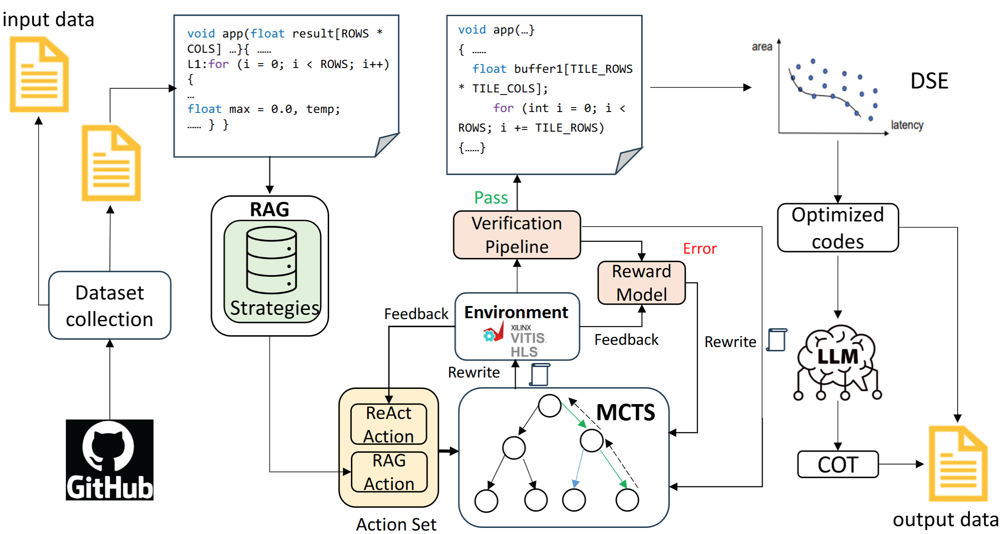

# HLStrans

HLStrans, a first Dataset for LLM-Driven C-to-HLS Hardware Code Synthesis for [HLStrans](https://huggingface.co/datasets/qingyun777yes/HLStrans). The dataset generation pipeline is below:



In this project, the directory structure is organized as follows:

   * DSE_flow and MCTS_flow: Dataset augmentation workflows
   * eval_models: Model evaluation scripts and utilities
   * lib_functions: Core library functions and helpers
   * model_sft: Model fine‑tuning and training pipelines
   * demo_case: Example cases demonstrating data augmentation
   * program_source: Source data and scripts used to build our datasets
   * data: include some generated datasets by MCTS flow for polybench benchmarks. argumentation_example/polybench/xxx/true are the generated datasets. 
## Prerequisites

This project was tested on Xilinx Alveo U55C and Vitis HLS 2022.1 suite. The tools are needed: 

* Vitis HLS tool chain

The following python libraries are required: 
   ```shell
   pip install -r requirements.txt
   ```

set your LLM API in lib_functions/lib_functions/llm_api.py

## Program Source

The dataset’s real‑world program sources are organized under the program_source directory, drawing from benchmarks like Polybench and MachSuite—as well as other GitHub projects. Polybench and MachSuite provide representative kernels, while the Unsupported_C folder contains C codes that failed synthesis alongside their human‑revised HLS counterparts. Each subfolder follows a consistent structure:

* Original C source
* Human‑optimized HLS code
* Corresponding testbench
* HLS synthesis script

This layout ensures that for every benchmark or project, you have both the unmodified and hand‑tuned HLS implementations, along with the support files needed for validation and synthesis.

## Dataset_Agumentation
The Dataset_Augmentation pipeline proceeds in two stages. First, it applies an MCTS‑driven transformation flow to convert original C/C++ sources into synthesizable HLS implementations, yielding a diverse set of optimized HLS variants. Next, it fine‑tunes pragma parameters using a genetic‑algorithm‑based Design Space Exploration (DSE), further improving performance and resource efficiency. 

1. MCTS exploration flow: In this phase, we leverage Monte Carlo Tree Search to navigate the vast, combinatorial space of code transformations with exceptional efficiency. Our system integrates a curated knowledge base of domain‑specific optimizations—enabling context‑aware, compiler‑informed decisions that significantly enhance an LLM’s native reasoning capabilities. Moreover, whenever synthesis errors arise, we consult a specialized bug‑repair table to automatically diagnose and correct them, ensuring a smooth and reliable transformation pipeline. 

   ```shell
   cd lib_functions
   pip install -e .
   cd ../MCTS_flow
   python3 exploration/mcts_exlore.py
   ```
2. Design Space Exploration (DSE) flow: mainly forcus on directive configurations using **Genetic Algorithms**, specifically the **NSGA-II** algorithm. It enables fine-grained exploration and tuning of hardware performance vs. resource usage for HLS designs targeting **Xilinx/AMD FPGAs** via the **Vitis HLS** toolchain. 

   * **Supported Directives**:
   * Loop Directives
      * pipeline
      * unroll
      * loop_flatten

   * Array Directives
      * array_partition
         * Modes: complete, block, cyclic
         * Parameters: variable, factor, dim
      * array_reshape
         * Modes: complete, block, cyclic
         * Parameters: variable, factor, dim
      * bind_storage
         * Parameters: variable, type (e.g., RAM_1P, RAM_2P, ROM_1P, ROM_2P), impl (e.g., bram, uram, lutram)

   * **Example: How to run DSE**:
   Here is an example, which shows how you run DSE for the given codes. 
      ```shell
      cd DSE_flow/vitis-convolution
      ../exec.sh run vitis-convolution .cpp
      ```
   After you finished the first step MCTS_flow, you get the optimized new codes:app.cpp. You can explore it with the DSE flow , follow these steps:

   (1). Create the dataset directory
      ```bash
      mkdir -p DSE_flow/dataset/app
      ```
   (2). Generate kernel information
   Run the [HLSAnalysisTools](https://github.com/aferikoglou/HLSAnalysisTools) on your `app.cpp` to produce `kernel_info.txt`.
   (3). Populate the dataset folder
      ```bash
      cp app.cpp kernel_info.txt DSE_flow/dataset/app/
      ```
   (4). Create the output directory
      ```bash
      mkdir -p DSE_flow/app
      ```
   (5). Run the design-space exploration
   Follow the existing examples in the `DSE_flow` repository, replacing the dataset path with your new `app` folder:
      ```bash
      ../exec.sh run app .cpp
      ```
   * **Multi-objective optimization** across:

   * Design Latency (msec)
   * BRAM%, DSP%, LUT%, and FF% Utilization

3. run the following codes to get the codes which has better performance with less resource than berfore.  
      ```bash
      python3 mv.py
      python3 collect_data.py
      ```
## Eval LLM
The script in eval_models adopt zero-shot, chain-of-thought, and retrieval-based prompt to evaluate the ability of LLM for HLS codes. The default model is Qwen2.5-Coder-32B-Instruct. 
   ```shell
   cd lib_functions
   pip install -e .
   cd eval_models/
   python3 test_model_best1.py
   python3 model_results_eval.py
   ```

## Training

After downloading the HLStrans dataset, place it under the data/ directory, then launch the preprocessing script. First, the removal script remove_testcase_from_dataset will strip out test cases. Next, fine‑tune your LLM on the cleaned dataset. If you’d like to evaluate on different data, simply pick one of the programs in program_source/ at random and use that as your test set.

```shell
python3 data/remove_testcase_from_dataset.py
# 3b
llamafactory-cli train model_sft/c2hls_3b.yaml
# 7b
llamafactory-cli train model_sft/c2hls_7b.yaml
```

## Acknowledgements
- [LLaMA-Factory](https://github.com/hiyouga/LLaMA-Factory) 🔗


